<p align="center">
  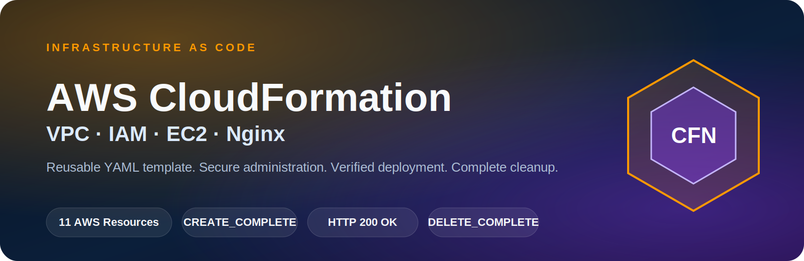
</p>

# AWS CloudFormation Infrastructure as Code

A verified Infrastructure as Code project that provisions a complete public Nginx web-server environment using a reusable AWS CloudFormation YAML template.

This project created the network, routing, security, IAM, compute, operating system, and web-server configuration automatically from code. After validation, the stack and all managed resources were deleted successfully.

## Quick Access

| Resource | Link |
|---|---|
| Live Project Preview | [Open GitHub Pages](https://nithishkumar-it.github.io/aws-cloudformation-iac/) |
| CloudFormation Template | [View `template.yaml`](template.yaml) |
| Deployment Guide | [View deployment steps](docs/deployment-guide.md) |
| Architecture Notes | [View architecture documentation](docs/architecture.md) |
| Portfolio | [Open Cloud and DevOps Portfolio](https://nithishkumar-it.github.io/nithishkumar-cloud-portfolio/) |

## Verified Outcome

| Validation | Result |
|---|---|
| CloudFormation stack | `CREATE_COMPLETE` |
| Managed AWS resources | 11 resources |
| Nginx service | `active (running)` |
| Local HTTP response | `HTTP/1.1 200 OK` |
| Public website | Successfully accessible |
| Secure administration | AWS Systems Manager Session Manager |
| Stack cleanup | `DELETE_COMPLETE` |

> The temporary AWS infrastructure was deleted after verification to avoid unnecessary charges. The GitHub Pages link is a permanent project preview and does not indicate that the AWS stack is currently running.

---

## Technology Matrix

<table>
  <tr>
    <td align="center" width="25%">
      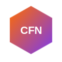<br>
      <b>AWS CloudFormation</b><br>
      <sub>Infrastructure orchestration</sub>
    </td>
    <td align="center" width="25%">
      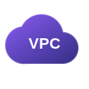<br>
      <b>Amazon VPC</b><br>
      <sub>Custom network environment</sub>
    </td>
    <td align="center" width="25%">
      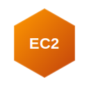<br>
      <b>Amazon EC2</b><br>
      <sub>Linux compute instance</sub>
    </td>
    <td align="center" width="25%">
      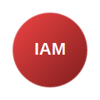<br>
      <b>AWS IAM</b><br>
      <sub>Role and instance profile</sub>
    </td>
  </tr>
  <tr>
    <td align="center">
      <br>
      <b>Systems Manager</b><br>
      <sub>Secure administration</sub>
    </td>
    <td align="center">
      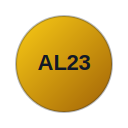<br>
      <b>Amazon Linux 2023</b><br>
      <sub>Server operating system</sub>
    </td>
    <td align="center">
      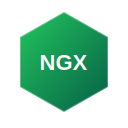<br>
      <b>Nginx</b><br>
      <sub>Static web server</sub>
    </td>
    <td align="center">
      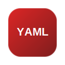<br>
      <b>YAML</b><br>
      <sub>Declarative template language</sub>
    </td>
  </tr>
  <tr>
    <td align="center">
      <br>
      <b>PowerShell</b><br>
      <sub>Validation and deployment scripts</sub>
    </td>
    <td align="center">
      <br>
      <b>Bash</b><br>
      <sub>EC2 User Data automation</sub>
    </td>
    <td align="center">
      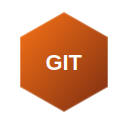<br>
      <b>Git</b><br>
      <sub>Version control</sub>
    </td>
    <td align="center">
      <br>
      <b>GitHub</b><br>
      <sub>Documentation and evidence</sub>
    </td>
  </tr>
</table>

> All technology icons are stored locally inside this repository. The README does not depend on external logo URLs.

---

## Problem Statement

Creating cloud infrastructure manually introduces several problems:

- Repetitive console work
- Configuration differences between environments
- Human error
- Difficult rollback
- Weak change history
- Slow resource cleanup
- Poor reproducibility

This project solves those problems by defining the complete environment in `template.yaml`.

```text
Manual infrastructure
        ↓
Multiple console operations
        ↓
Possible configuration drift

Infrastructure as Code
        ↓
Version-controlled YAML template
        ↓
Repeatable and reviewable deployment
```

---

## Solution Overview

The CloudFormation template provisions:

```text
Custom VPC
├── Internet Gateway
├── Public Subnet
├── Public Route Table
│   └── 0.0.0.0/0 → Internet Gateway
├── Web Security Group
│   └── Inbound TCP 80
├── IAM Role
├── EC2 Instance Profile
└── Amazon EC2
    ├── Amazon Linux 2023
    ├── IMDSv2 required
    ├── Encrypted gp3 root volume
    ├── SSM Agent access
    └── Nginx website installed by User Data
```

---

## Provisioning Architecture

This diagram explains how the source code becomes real AWS infrastructure.

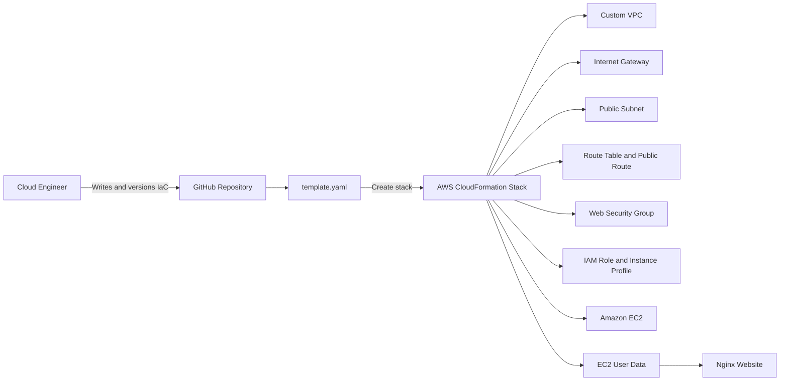

### Provisioning Flow

```text
GitHub Repository
    ↓
CloudFormation YAML Template
    ↓
CloudFormation Stack
    ↓
Dependency-aware resource creation
    ↓
EC2 User Data execution
    ↓
Nginx website deployment
```

---

## Runtime Architecture

The route table is associated with the public subnet and contains the default route to the Internet Gateway. It is not represented as a standalone traffic-processing device.

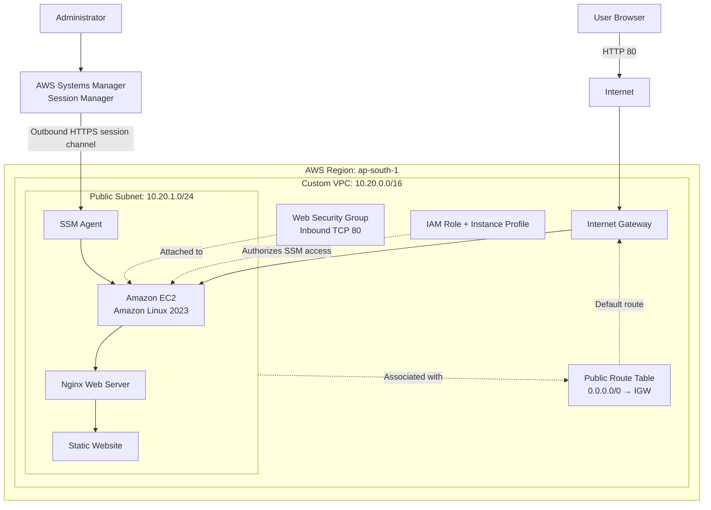

### Public Request Flow

```text
User Browser
    ↓ HTTP port 80
Internet
    ↓
Internet Gateway
    ↓
Public IP on EC2
    ↓
Security Group validation
    ↓
Nginx
    ↓
Static Website
```

### Secure Administration Flow

```text
Administrator
    ↓
AWS Systems Manager Session Manager
    ↓
SSM service endpoint over HTTPS
    ↓
SSM Agent on EC2
    ↓
IAM role authorization
    ↓
Secure terminal session
```

No inbound SSH rule or private key was required.

---

## AWS Resources Created

| Logical ID | CloudFormation Type | Purpose |
|---|---|---|
| `ProjectVPC` | `AWS::EC2::VPC` | Custom isolated network |
| `InternetGateway` | `AWS::EC2::InternetGateway` | Internet connectivity |
| `InternetGatewayAttachment` | `AWS::EC2::VPCGatewayAttachment` | Attaches the gateway to the VPC |
| `PublicSubnet` | `AWS::EC2::Subnet` | Public subnet for the web server |
| `PublicRouteTable` | `AWS::EC2::RouteTable` | Routing configuration |
| `DefaultPublicRoute` | `AWS::EC2::Route` | Default internet route |
| `PublicSubnetRouteTableAssociation` | `AWS::EC2::SubnetRouteTableAssociation` | Associates subnet and route table |
| `WebSecurityGroup` | `AWS::EC2::SecurityGroup` | Allows HTTP traffic |
| `EC2SSMRole` | `AWS::IAM::Role` | SSM permissions |
| `EC2InstanceProfile` | `AWS::IAM::InstanceProfile` | Attaches the IAM role to EC2 |
| `WebServer` | `AWS::EC2::Instance` | Runs Amazon Linux and Nginx |

---

## Security Controls

| Control | Implementation |
|---|---|
| SSH exposure | Port 22 was not opened |
| Administration | AWS Systems Manager Session Manager |
| AWS credentials | IAM role instead of hardcoded keys |
| Instance metadata | IMDSv2 required |
| Storage | Encrypted 8 GiB gp3 root volume |
| Public inbound access | HTTP port 80 only |
| Sensitive files | Excluded using `.gitignore` |
| Evidence protection | Account and resource identifiers sanitized |

### Security Group

| Direction | Protocol | Port | Source | Purpose |
|---|---|---:|---|---|
| Inbound | TCP | 80 | `0.0.0.0/0` | Public website access |
| Outbound | All | All | `0.0.0.0/0` | Package installation and AWS service communication |

---

## Template Design

```text
template.yaml
├── AWSTemplateFormatVersion
├── Description
├── Parameters
├── Resources
└── Outputs
```

### Parameters

| Parameter | Purpose |
|---|---|
| `ProjectName` | Naming and tagging prefix |
| `Environment` | `dev`, `test`, or `prod` |
| `InstanceType` | EC2 instance size |
| `LatestAmiId` | Latest Amazon Linux 2023 AMI through SSM Parameter Store |

### Intrinsic Functions

| Function | Use |
|---|---|
| `Ref` | Returns parameter and resource values |
| `Fn::Sub` | Builds names and URLs dynamically |
| `Fn::GetAtt` | Reads resource attributes |
| `Fn::Select` | Selects an Availability Zone |
| `Fn::GetAZs` | Returns Availability Zones |
| `Fn::Base64` | Encodes EC2 User Data |
| `DependsOn` | Enforces an explicit dependency |

### Outputs

| Output | Purpose |
|---|---|
| `WebsiteURL` | Public Nginx website URL |
| `InstanceId` | EC2 instance ID |
| `PublicIp` | Public IPv4 address |
| `VpcId` | VPC ID |
| `PublicSubnetId` | Public subnet ID |
| `WebSecurityGroupId` | Security Group ID |

---

## Automated EC2 Configuration

EC2 User Data performs the initial server configuration automatically.

```text
Launch Amazon Linux 2023
    ↓
Update packages
    ↓
Install Nginx
    ↓
Create the website file
    ↓
Enable and restart Nginx
    ↓
Validate Nginx configuration
    ↓
Verify the local HTTP response
```

Core commands:

```bash
dnf update -y
dnf install -y nginx
systemctl enable nginx
systemctl restart nginx
nginx -t
curl --retry 10 --fail http://localhost
```

---

## Repository Structure

```text
aws-cloudformation-iac/
├── README.md
├── LICENSE
├── .gitignore
├── index.html
├── template.yaml
├── assets/
│   ├── icons/
│   │   ├── cloudformation.svg
│   │   ├── vpc.svg
│   │   ├── ec2.svg
│   │   ├── iam.svg
│   │   ├── systems-manager.svg
│   │   ├── amazon-linux.svg
│   │   ├── nginx.svg
│   │   ├── yaml.svg
│   │   ├── powershell.svg
│   │   ├── bash.svg
│   │   ├── git.svg
│   │   └── github.svg
│   └── readme/
│       └── cloudformation-banner.svg
├── parameters/
│   └── dev.json
├── docs/
│   ├── architecture.md
│   ├── deployment-guide.md
│   └── learning-notes.md
├── scripts/
│   ├── validate-template.ps1
│   ├── deploy-stack.ps1
│   └── delete-stack.ps1
└── screenshots/
    ├── 01-stack-create-complete.png
    ├── 02-stack-resources.png
    ├── 03-stack-outputs.png
    ├── 04-live-website.png
    ├── 05-session-manager-verification.png
    └── 06-stack-delete-complete.png
```

---

## Deployment

### Console Deployment Used for Verification

```text
AWS Console
→ CloudFormation
→ Create stack
→ With new resources
→ Upload template.yaml
→ Configure parameters
→ Acknowledge named IAM resources
→ Submit
```

Final creation status:

```text
CREATE_COMPLETE
```

### Optional CLI Validation

```powershell
.\scripts\validate-template.ps1
```

Equivalent command:

```powershell
aws cloudformation validate-template `
  --template-body file://template.yaml `
  --region ap-south-1
```

### Optional CLI Deployment

```powershell
.\scripts\deploy-stack.ps1
```

Equivalent command:

```powershell
aws cloudformation deploy `
  --template-file template.yaml `
  --stack-name nithish-cloudformation-web `
  --region ap-south-1 `
  --capabilities CAPABILITY_NAMED_IAM `
  --parameter-overrides `
    ProjectName=nithish-cloudformation-web `
    Environment=dev `
    InstanceType=t3.micro
```

---

## Deployment Evidence

### 1. Stack Creation

The stack reached `CREATE_COMPLETE`.

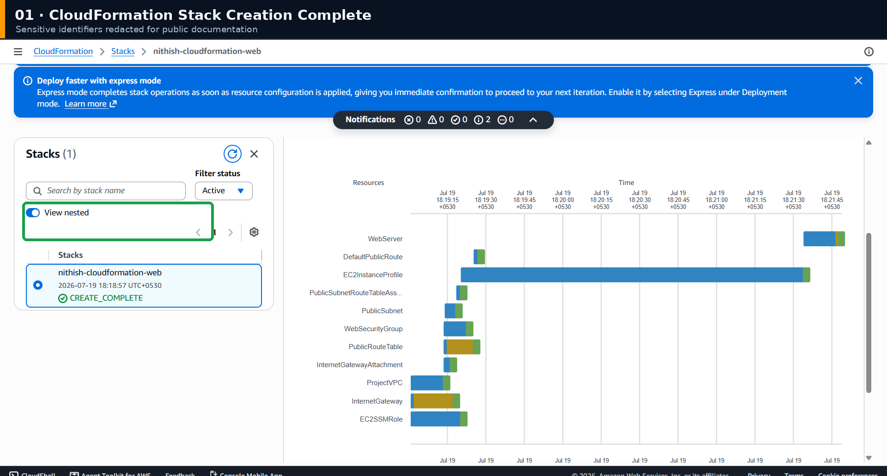

### 2. Managed Resources

CloudFormation created and managed all 11 declared resources.

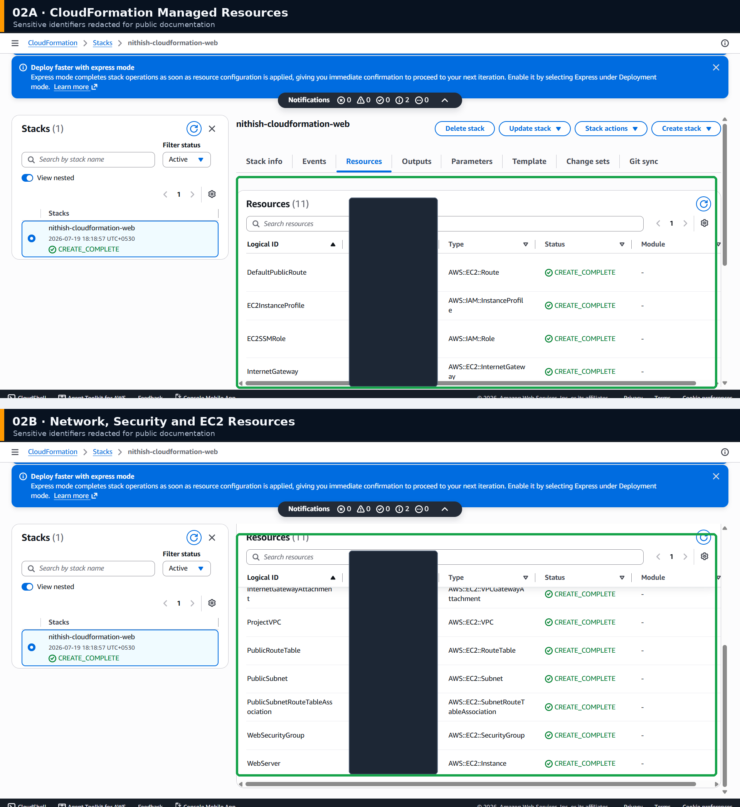

### 3. Stack Outputs

CloudFormation generated the website and infrastructure outputs.

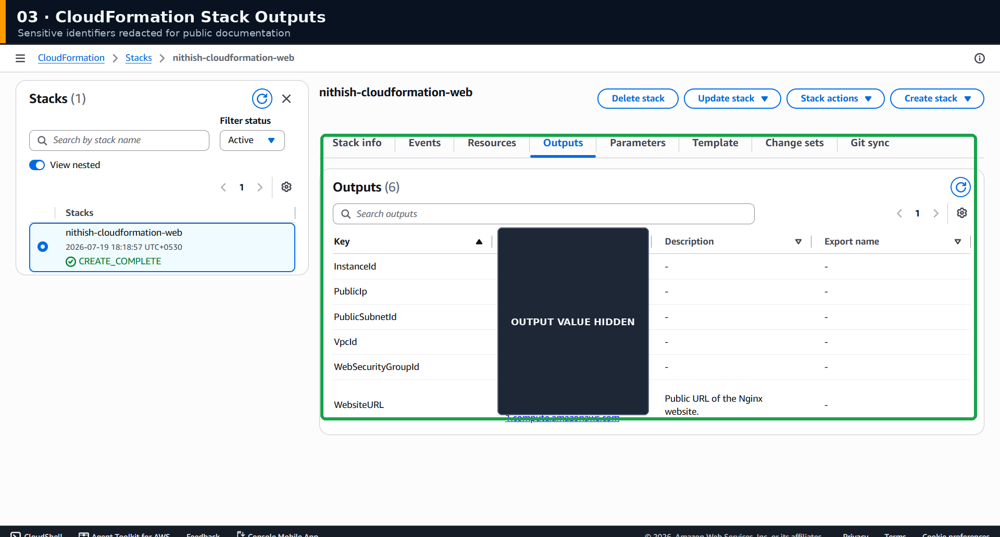

### 4. Live Website

The Nginx website was publicly accessible after User Data completed.

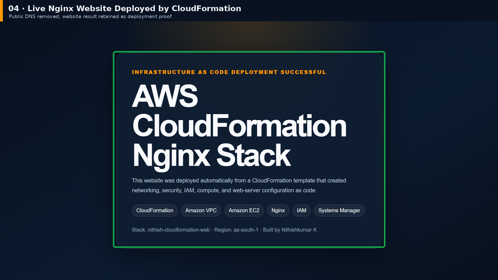

### 5. Systems Manager Verification

The server was managed without public SSH access.

Verified:

```text
Nginx: active (running)
HTTP response: HTTP/1.1 200 OK
```

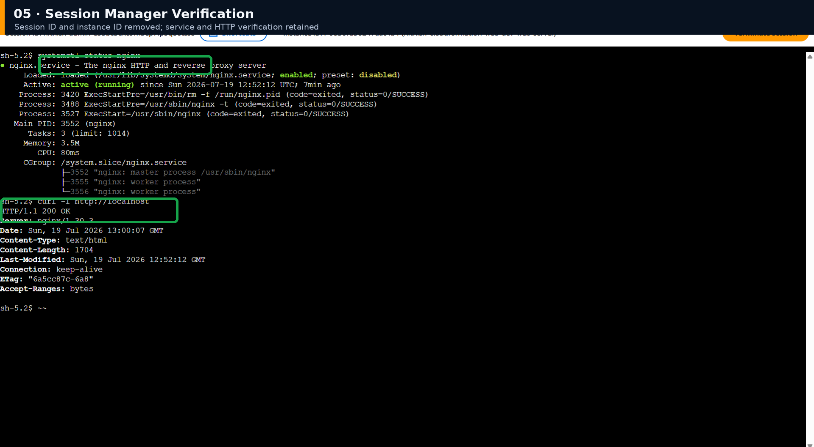

### 6. Stack Cleanup

The entire stack reached `DELETE_COMPLETE`.

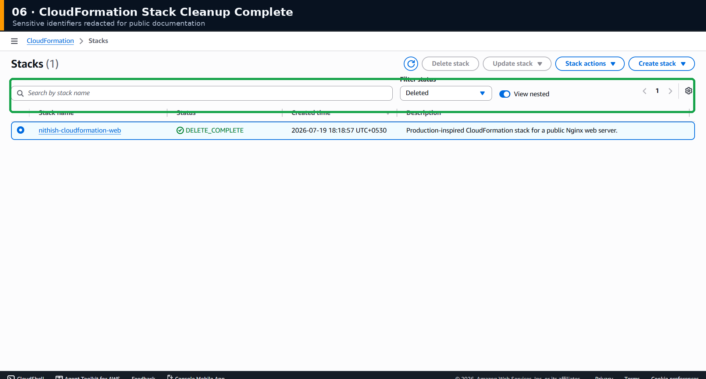

---

## Stack Lifecycle

```mermaid
flowchart LR
    Code["Write or update template"]
    Validate["Validate"]
    Create["CREATE_IN_PROGRESS"]
    Complete["CREATE_COMPLETE"]
    Verify["Verify website and server"]
    Delete["DELETE_IN_PROGRESS"]
    Removed["DELETE_COMPLETE"]

    Code --> Validate
    Validate --> Create
    Create --> Complete
    Complete --> Verify
    Verify --> Delete
    Delete --> Removed
```

---

## Cleanup

The stack was deleted through CloudFormation after verification.

```text
Delete stack
    ↓
CloudFormation resolves dependencies
    ↓
EC2 and dependent resources removed
    ↓
Network resources removed
    ↓
IAM resources removed
    ↓
DELETE_COMPLETE
```

Optional CLI cleanup:

```powershell
.\scripts\delete-stack.ps1
```

---

## Key Learnings

- Infrastructure as Code converts infrastructure into version-controlled configuration.
- A template is the blueprint; a stack is the deployed infrastructure.
- Parameters make templates reusable.
- Intrinsic functions connect resource values.
- CloudFormation manages creation order and rollback.
- User Data automates application installation.
- IAM roles avoid hardcoded AWS credentials.
- Systems Manager replaces public SSH administration.
- Outputs expose deployment values.
- Stack deletion performs dependency-aware cleanup.
- Drift detection can identify manual changes outside the template.
- Change sets preview updates before execution.

---

## Template vs Stack

```text
Template = YAML blueprint
Stack    = AWS resources created from the blueprint
```

---

## Limitations

- Single Availability Zone
- Single EC2 instance
- HTTP only
- No Application Load Balancer
- No Auto Scaling Group
- No Route 53 domain
- No CloudWatch alarms
- Public subnet hosts the web server
- No automated CI/CD pipeline

## Production Enhancements

- Multi-AZ public and private subnet design
- Application Load Balancer
- Auto Scaling Group
- HTTPS using AWS Certificate Manager
- Route 53
- CloudWatch alarms and dashboards
- VPC endpoints for Systems Manager
- CloudFormation change sets
- Drift detection
- CI/CD deployment
- Nested stacks or reusable modules

---

## Interview-Ready Explanation

> I built an Infrastructure as Code project using AWS CloudFormation. The YAML template provisioned a custom VPC, public subnet, Internet Gateway, route table, Security Group, IAM role, instance profile, and Amazon Linux EC2 instance. EC2 User Data installed and configured Nginx automatically. I verified the stack outputs, public website, Nginx service status, HTTP 200 response, and Systems Manager access without opening SSH port 22. After validation, I deleted the stack, which removed all CloudFormation-managed resources in dependency order.

---

## Author

**Nithishkumar K**

Final-year B.Tech Information Technology student focused on AWS, Cloud Engineering, Linux, Python, Docker, DevOps, and Infrastructure as Code.

- GitHub: [NITHISHKUMAR-IT](https://github.com/NITHISHKUMAR-IT)
- Portfolio: [Cloud and DevOps Portfolio](https://nithishkumar-it.github.io/nithishkumar-cloud-portfolio/)
- Email: [nithishdev29@gmail.com](mailto:nithishdev29@gmail.com)
- LinkedIn: [Nithishkumar K](https://www.linkedin.com/in/nithishkumar-k-072726388)

## License

This project is licensed under the [MIT License](LICENSE).
