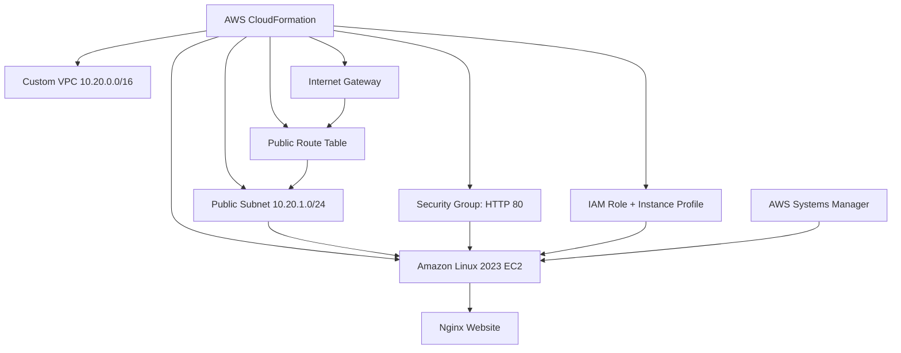

# Architecture Design

## Design Decisions

- Custom VPC avoids dependency on the default VPC.
- Public subnet provides internet access for Nginx.
- No inbound SSH rule is created.
- Session Manager replaces key-based SSH administration.
- IMDSv2 and encrypted gp3 storage strengthen the instance configuration.
